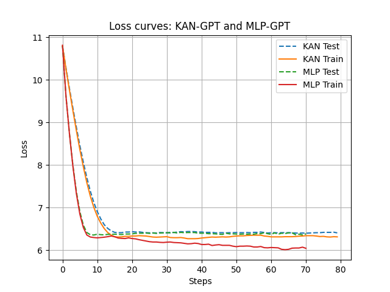
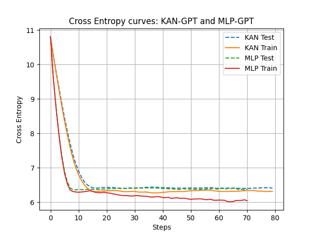

The PyTorch implementation of Generative Pre-trained Transformers (GPTs) using Kolmogorov-Arnold Networks (KANs) for language modeling

## Install it from PyPI

```bash
pip install kan_gpt
```

## Citation

If you find our work useful cite me!

```
@misc{DikshantV2024KANGPT,
  author       = {Dikshant Vashistha},
  title        = {KAN-GPT: The PyTorch implementation of Generative Pre-trained Transformers (GPTs) using Kolmogorov-Arnold Networks (KANs) for language modeling},
  year         = {2024},
  month        = {May},
  note         = {Release 1.0.0, 9th May 2024},
  
}
```

## Usage

The following is an outline of how to use the model:

```py
from kan_gpt.model import GPT
from transformers import GPT2Tokenizer

model_config = GPT.get_default_config()
model_config.model_type = "gpt2"
model_config.vocab_size = 50257
model_config.block_size = 1024
model = GPT(model_config)

tokenizer = GPT2Tokenizer.from_pretrained('gpt2')

prompt = "Bangalore is often described as the "

prompt_encoded = tokenizer.encode(
  text=prompt, add_special_tokens=False
)

x = torch.tensor(prompt_encoded).unsqueeze(0)

model.eval()
y = model.generate(x, 50)  # sample 50 tokens

result = tokenizer.decode(y[0])

print(result)

# Bangalore is often described as the Silicon Valley of India.
# The city has witnessed rapid growth in the past two decades.....
```

## Setup for Development

```bash
# Download Repo
git clone https://github.com/AdityaNG/kan-gpt
cd kan-gpt
git pull

# Download Dataset
python3 -m kan_gpt.download_dataset --dataset tinyshakespeare
python3 -m kan_gpt.download_dataset --dataset mnist
python3 -m kan_gpt.download_dataset --dataset webtext

# Install dependencies for development
pip install -r requirements.txt
pip install -e .
```

## Train

Use the following dummy script to make sure everything is working as expected
```bash
WANDB_MODE=offline CUDA_VISIBLE_DEVICE="" python3 -m kan_gpt.train --architecture MLP --batch_size 1 --dummy_dataset --device cpu --max_iters 200
WANDB_MODE=offline CUDA_VISIBLE_DEVICE="" python3 -m kan_gpt.train --architecture KAN --batch_size 1 --dummy_dataset --device cpu --max_iters 200
```

Then make use of the training script
```bash
python -m kan_gpt.train
```

## Prompt

You can prompt the model to produce text as follows
```bash
python -m kan_gpt.prompt --prompt "Bangalore is often described as the " --model_path (checkpoint)
```

## Results

We train and compare KAN-GPT with an equivalent MLP-GPT model on the Tiny Shakespeare dataset. We observe that the KAN-GPT performs slightly better than the MLP-GPT. We are looking into further experiments to dive deeper. The results are shown below:


| Metrics |   |   |
|---------|---------|---------|
|  |  |  |

## TODOs

- [x] Integrate [minGPT](https://github.com/karpathy/minGPT) and [pykan](https://github.com/KindXiaoming/pykan)
- [x] Dataset downloading script for [WebText](https://github.com/openai/gpt-2-output-dataset)
- [x] PyTorch Dataset parser for [WebText](https://github.com/openai/gpt-2-output-dataset)
- [x] PyTorch Dataset parser for [tinyshakespeare](https://raw.githubusercontent.com/karpathy/char-rnn/master/data/tinyshakespeare/input.txt)
- [x] Mini training POC for KAN-GPT
  - [x] Integrate KAN training logic from `KAN.train_kan`
  - [x] Train a dummy batch w/o any memory issues
- [x] Mini training POC for MLP-GPT
- [x] Train MLP-GPT on the webtext dataset as a baseline
- [x] Train KAN-GPT on the webtext dataset as a baseline
- [x] Metrics comparing KAN-GPT and MLP-GPT
- [x] Auto Save checkpoints
- [x] Auto Save checkpoints to W&B
- [ ] Auto Download model weights from git / huggingface
- [x] W&B hyperparam sweep script
- [x] Script to load checkpoint in interactive mode
- [ ] Reduce requrements.txt constraints
- [ ] Define pydantic model for training and sweep args
- [ ] Pruning the package, get rid of unused code
- [ ] Training script to PyTorch Lighting
- [x] Documentation: `mkdocs gh-deploy`
- [x] Integrate with [efficient-kan](https://github.com/Blealtan/efficient-kan/blob/master/src/efficient_kan/kan.py)
- [x] Test Cases
  - [x] KAN: Forward-Backward test
  - [x] GPT: Forward-Backward test
  - [x] KAN_GPT: Forward-Backward test
  - [x] EFFICIENT_KAN: Forward-Backward test


## References

- [minGPT](https://github.com/karpathy/minGPT)
- [pykan](https://github.com/KindXiaoming/pykan)
- [webtext](https://github.com/openai/gpt-2-output-dataset)
- [tinyshakespeare](https://raw.githubusercontent.com/karpathy/char-rnn/master/data/tinyshakespeare/input.txt)
